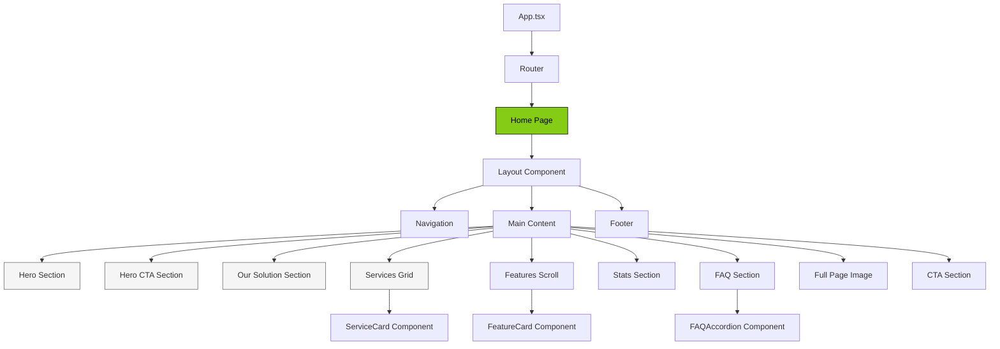
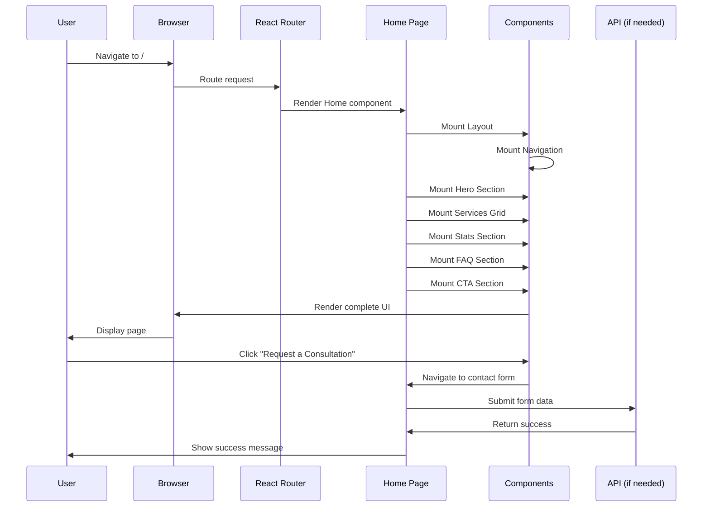
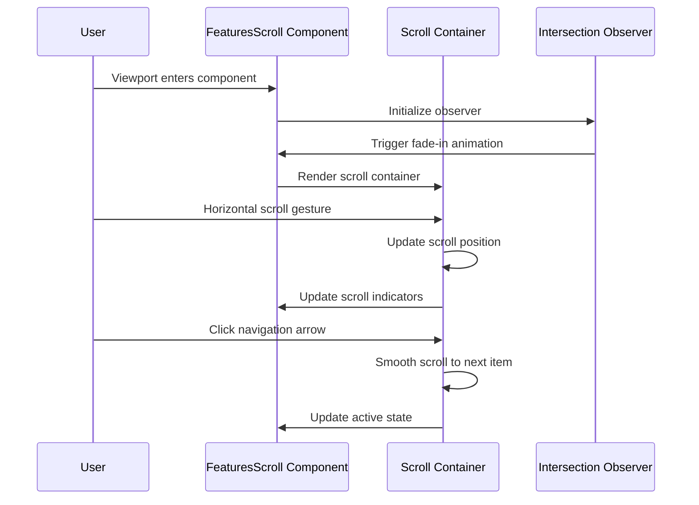

# Design Document: Nichols Transportation Frontend Redesign

## Overview

The Nichols Transportation frontend redesign transforms the existing website into a modern, visually striking logistics platform that matches the provided screenshot specifications. The redesign maintains the existing React + TypeScript + Vite + Tailwind CSS + shadcn/ui tech stack while implementing a fresh visual identity with a lime green (#84CC16) and black (#000000) color scheme on clean white/gray backgrounds. The design focuses on bold typography, high-quality imagery, clear information hierarchy, and conversion-optimized CTAs.

The redesign includes 11 distinct sections: hero with statistics, services grid with 8 service cards, horizontal scrolling features, stats showcase, FAQ accordion, full-page imagery, CTA section, and comprehensive footer. All sections are fully responsive and maintain consistent spacing, typography, and interaction patterns.

## Architecture

The redesign maintains the existing SPA architecture using React Router (wouter) but restructures the home page into modular, reusable components. Each major section becomes an independent component for maintainability and reusability.



## Sequence Diagrams

### Page Load and Rendering Flow



### Horizontal Scroll Interaction



## Components and Interfaces

### Component 1: HeroSection

**Purpose**: Display the primary hero section with aerial container yard imagery, company description, and key statistics.

**Interface**:
```typescript
interface HeroSectionProps {
  title: string
  description: string
  backgroundImage: string
  statistics: Statistic[]
}

interface Statistic {
  value: string
  label: string
  suffix?: string
}
```

**Responsibilities**:
- Render full-viewport hero with background image
- Display company mission and value proposition
- Show three key statistics (500+, 97%, 24/7)
- Handle responsive layout for mobile/tablet/desktop

### Component 2: HeroCTASection

**Purpose**: Display secondary hero with desert highway truck image and prominent CTA button.

**Interface**:
```typescript
interface HeroCTASectionProps {
  headline: string
  subheadline?: string
  ctaText: string
  ctaLink: string
  backgroundImage: string
  imageAlt: string
}
```

**Responsibilities**:
- Render impactful hero with large typography
- Display "LOGISTICS THAT MOVE WITH PRECISION" heading
- Render "Request a Consultation" CTA button
- Ensure high contrast for readability

### Component 3: OurSolutionSection

**Purpose**: Display large-format section explaining the transportation and carrier support solutions.

**Interface**:
```typescript
interface OurSolutionSectionProps {
  heading: string
  description: string
  features?: string[]
}
```

**Responsibilities**:
- Render oversized heading with "Our Solution" text
- Display multi-paragraph description
- Handle responsive typography scaling
- Maintain proper whitespace and readability

### Component 4: ServicesGrid

**Purpose**: Display 8 service cards in a responsive grid layout with varying background colors.

**Interface**:
```typescript
interface ServicesGridProps {
  services: Service[]
  columns?: number
}

interface Service {
  id: string
  title: string
  description: string
  icon?: string
  backgroundColor: ServiceColor
  link: string
}

type ServiceColor = 'lime' | 'beige' | 'black' | 'gray'
```

**Responsibilities**:
- Render 8 service cards in 2-4 column grid
- Apply correct background colors per screenshot:
  - Dedicated Freight Lanes: lime green (#84CC16)
  - Trailer Rental Program: beige (#F5F5DC)
  - TWIC Card Assistance: black (#000000)
  - Insurance Assistance: light gray (#F3F4F6)
  - Factoring Registration: black (#000000)
  - Specialized Permit Loads: lime green (#84CC16)
  - Permit Application Support: light gray (#F3F4F6)
  - DOT Compliance Support: black (#000000)
- Handle hover states and card interactions
- Ensure responsive grid layout

### Component 5: FeaturesScroll

**Purpose**: Display horizontally scrolling feature cards with key service highlights.

**Interface**:
```typescript
interface FeaturesScrollProps {
  features: Feature[]
  autoScroll?: boolean
  scrollSpeed?: number
}

interface Feature {
  id: string
  title: string
  description?: string
  image?: string
}
```

**Responsibilities**:
- Render horizontal scrolling container
- Display feature cards: "Insurance Compliance", "Factoring Support", "Moving Carriers Forward", "Dedicated Lanes"
- Implement smooth scroll behavior
- Add scroll indicators/navigation
- Support touch gestures for mobile

### Component 6: StatsSection

**Purpose**: Display large-format statistics with "10K+" loads dispatched metric and carrier network description.

**Interface**:
```typescript
interface StatsSectionProps {
  primaryStat: {
    value: string
    label: string
    description: string
  }
  backgroundImage?: string
  theme?: 'light' | 'dark'
}
```

**Responsibilities**:
- Render large "10K+" text in lime green
- Display "LOADS DISPATCHED" label
- Show carrier network description
- Overlay white truck image
- Maintain visual hierarchy

### Component 7: FAQSection

**Purpose**: Display accordion-style frequently asked questions section.

**Interface**:
```typescript
interface FAQSectionProps {
  faqs: FAQ[]
  defaultOpen?: string[]
}

interface FAQ {
  id: string
  question: string
  answer: string
}
```

**Responsibilities**:
- Render accordion component using shadcn/ui Accordion
- Handle expand/collapse interactions
- Display questions and answers
- Maintain accessible keyboard navigation
- Animate transitions

### Component 8: FullPageImage

**Purpose**: Display full-page immersive section with trailer truck on foggy highway.

**Interface**:
```typescript
interface FullPageImageProps {
  image: string
  alt: string
  overlay?: boolean
  overlayOpacity?: number
}
```

**Responsibilities**:
- Render full-viewport image section
- Apply subtle overlay if needed
- Ensure image covers entire section
- Handle responsive image loading
- Optimize for performance

### Component 9: CTASection

**Purpose**: Display prominent call-to-action with "Ready to haul more freight" message.

**Interface**:
```typescript
interface CTASectionProps {
  heading: string
  ctaText: string
  ctaLink: string
  theme?: 'dark' | 'light'
}
```

**Responsibilities**:
- Render dark background CTA section
- Display compelling headline
- Show "Get Started Today" button
- Center content for impact
- Handle responsive layout

### Component 10: Footer

**Purpose**: Display comprehensive footer with sitemap, quick links, contact details, and social media.

**Interface**:
```typescript
interface FooterProps {
  sitemap: FooterLink[]
  quickLinks: FooterLink[]
  trackSupport: FooterLink[]
  contactInfo: ContactInfo
  socialLinks: SocialLink[]
}

interface FooterLink {
  label: string
  href: string
}

interface ContactInfo {
  emails: string[]
  address: {
    street: string
    city: string
    state: string
    zip: string
  }
  phones: string[]
}

interface SocialLink {
  platform: string
  url: string
  icon: string
}
```

**Responsibilities**:
- Render multi-column footer layout
- Display sitemap (Home, About Us, Carrier Services, Insurance Solutions, Permits and Certificates, Contact Us)
- Show Quick Links section
- Display Track & Support section
- Show contact information (brandon@nicholstransportation.com, billing@nicholstransportation.com)
- Display address: 111 Pecan Row Ln, Alexandria LA 71303
- Show phone numbers
- Render social media icons
- Display large "NICHOLS" branding text at bottom
- Ensure responsive footer layout

### Component 11: ServiceCard

**Purpose**: Reusable card component for service grid items.

**Interface**:
```typescript
interface ServiceCardProps {
  title: string
  description: string
  icon?: React.ReactNode
  backgroundColor: ServiceColor
  link: string
  theme?: 'light' | 'dark'
}
```

**Responsibilities**:
- Render individual service card
- Apply background color
- Handle hover states
- Display icon and text
- Support both light and dark text themes based on background
- Navigate to service detail page on click

## Data Models

### Service

```typescript
interface Service {
  id: string
  title: string
  description: string
  icon?: string
  backgroundColor: ServiceColor
  textTheme: 'light' | 'dark'
  link: string
  createdAt?: Date
  updatedAt?: Date
}

type ServiceColor = 'lime' | 'beige' | 'black' | 'gray'
```

**Validation Rules**:
- `id` must be unique and non-empty
- `title` must be 3-100 characters
- `description` must be 10-500 characters
- `backgroundColor` must be one of: 'lime', 'beige', 'black', 'gray'
- `textTheme` must be one of: 'light', 'dark'
- `link` must be valid URL or path

### Feature

```typescript
interface Feature {
  id: string
  title: string
  description?: string
  image?: string
  order: number
}
```

**Validation Rules**:
- `id` must be unique
- `title` must be non-empty
- `order` must be positive integer
- `image` must be valid image URL or path if provided

### FAQ

```typescript
interface FAQ {
  id: string
  question: string
  answer: string
  category?: string
  order: number
}
```

**Validation Rules**:
- `id` must be unique
- `question` must be 5-500 characters
- `answer` must be 10-5000 characters
- `order` must be positive integer

### ContactFormData

```typescript
interface ContactFormData {
  fullName: string
  email: string
  phone?: string
  company?: string
  message: string
  source: 'hero' | 'cta' | 'contact-page'
  timestamp: Date
}
```

**Validation Rules**:
- `fullName` must be 2-100 characters
- `email` must be valid email format
- `phone` must be valid phone number if provided
- `message` must be 10-2000 characters
- `source` must be one of: 'hero', 'cta', 'contact-page'

## Algorithmic Pseudocode

### Main Page Rendering Algorithm

```typescript
// Algorithm: Render Home Page
// Input: None (page load)
// Output: Rendered React component tree

function HomePage(): JSX.Element {
  // Step 1: Initialize state and refs
  const scrollContainerRef = useRef<HTMLDivElement>(null)
  const [activeSection, setActiveSection] = useState<string>('hero')
  
  // Step 2: Set up intersection observers for animations
  useEffect(() => {
    const observers = setupIntersectionObservers()
    return () => cleanupObservers(observers)
  }, [])
  
  // Step 3: Load dynamic content (services, FAQs, stats)
  const services = useServices() // Load from data file or API
  const faqs = useFAQs()
  const stats = useStats()
  
  // Step 4: Render component tree
  return (
    <Layout>
      <HeroSection {...heroProps} />
      <HeroCTASection {...heroCTAProps} />
      <OurSolutionSection {...solutionProps} />
      <ServicesGrid services={services} />
      <FeaturesScroll features={features} ref={scrollContainerRef} />
      <StatsSection {...statsProps} />
      <FAQSection faqs={faqs} />
      <FullPageImage {...fullPageProps} />
      <CTASection {...ctaProps} />
    </Layout>
  )
}
```

**Preconditions**:
- React application is initialized
- Router is configured
- Theme provider is available
- Data sources (services, FAQs) are accessible

**Postconditions**:
- All sections render in correct order
- Intersection observers are active
- Scroll behavior is initialized
- Component is ready for user interaction

**Loop Invariants**: N/A (no explicit loops in main render)

### Horizontal Scroll Navigation Algorithm

```typescript
// Algorithm: Navigate horizontal scroll container
// Input: direction ('left' | 'right'), scrollContainer (HTMLElement)
// Output: Updated scroll position

function navigateScroll(
  direction: 'left' | 'right',
  scrollContainer: HTMLElement
): void {
  // Precondition: scrollContainer is valid DOM element
  assert(scrollContainer !== null, "Scroll container must exist")
  
  // Step 1: Get current scroll position and container width
  const currentScroll = scrollContainer.scrollLeft
  const containerWidth = scrollContainer.clientWidth
  const scrollAmount = containerWidth * 0.8 // Scroll 80% of container width
  
  // Step 2: Calculate target scroll position
  const targetScroll = direction === 'right'
    ? currentScroll + scrollAmount
    : currentScroll - scrollAmount
  
  // Step 3: Clamp target to valid range
  const maxScroll = scrollContainer.scrollWidth - containerWidth
  const clampedTarget = Math.max(0, Math.min(targetScroll, maxScroll))
  
  // Step 4: Perform smooth scroll
  scrollContainer.scrollTo({
    left: clampedTarget,
    behavior: 'smooth'
  })
  
  // Postcondition: Scroll position is updated
  assert(
    scrollContainer.scrollLeft !== currentScroll || 
    currentScroll === 0 || 
    currentScroll === maxScroll,
    "Scroll position should change unless at boundary"
  )
}
```

**Preconditions**:
- `scrollContainer` is valid HTMLElement with horizontal scroll
- `direction` is either 'left' or 'right'
- Container has scrollable content

**Postconditions**:
- Scroll position moves by ~80% of container width
- Scroll position stays within valid bounds [0, maxScroll]
- Smooth scroll animation is triggered
- No errors thrown

**Loop Invariants**: N/A (no loops)

### Service Card Color Assignment Algorithm

```typescript
// Algorithm: Assign correct background color to service card
// Input: serviceTitle (string)
// Output: ServiceColor and textTheme

function getServiceCardStyle(serviceTitle: string): {
  backgroundColor: ServiceColor
  textTheme: 'light' | 'dark'
} {
  // Precondition: serviceTitle is non-empty string
  assert(serviceTitle.length > 0, "Service title must be non-empty")
  
  // Step 1: Normalize title for comparison
  const normalizedTitle = serviceTitle.toLowerCase().trim()
  
  // Step 2: Map title to color scheme using lookup table
  const colorMap: Record<string, { backgroundColor: ServiceColor, textTheme: 'light' | 'dark' }> = {
    'dedicated freight lanes': { backgroundColor: 'lime', textTheme: 'dark' },
    'trailer rental program': { backgroundColor: 'beige', textTheme: 'dark' },
    'twic card assistance': { backgroundColor: 'black', textTheme: 'light' },
    'insurance assistance': { backgroundColor: 'gray', textTheme: 'dark' },
    'factoring registration': { backgroundColor: 'black', textTheme: 'light' },
    'specialized permit loads': { backgroundColor: 'lime', textTheme: 'dark' },
    'permit application support': { backgroundColor: 'gray', textTheme: 'dark' },
    'dot compliance support': { backgroundColor: 'black', textTheme: 'light' }
  }
  
  // Step 3: Lookup and return style, default to gray if not found
  const style = colorMap[normalizedTitle] || { backgroundColor: 'gray' as ServiceColor, textTheme: 'dark' as const }
  
  // Postcondition: Valid color and theme returned
  assert(
    ['lime', 'beige', 'black', 'gray'].includes(style.backgroundColor),
    "Background color must be valid ServiceColor"
  )
  assert(
    ['light', 'dark'].includes(style.textTheme),
    "Text theme must be either light or dark"
  )
  
  return style
}
```

**Preconditions**:
- `serviceTitle` is non-empty string
- Service titles match expected values

**Postconditions**:
- Returns valid `ServiceColor` ('lime' | 'beige' | 'black' | 'gray')
- Returns appropriate `textTheme` ('light' | 'dark')
- Black backgrounds always use light text
- Lime, beige, gray backgrounds use dark text
- Unknown titles default to gray with dark text

**Loop Invariants**: N/A (no loops)

### FAQ Accordion Toggle Algorithm

```typescript
// Algorithm: Toggle FAQ accordion item
// Input: faqId (string), currentOpenIds (string[])
// Output: Updated array of open FAQ IDs

function toggleFAQ(
  faqId: string,
  currentOpenIds: string[]
): string[] {
  // Precondition: faqId is valid FAQ identifier
  assert(faqId.length > 0, "FAQ ID must be non-empty")
  assert(Array.isArray(currentOpenIds), "currentOpenIds must be array")
  
  // Step 1: Check if FAQ is currently open
  const isCurrentlyOpen = currentOpenIds.includes(faqId)
  
  // Step 2: Toggle state
  let newOpenIds: string[]
  
  if (isCurrentlyOpen) {
    // Close: Remove from array
    newOpenIds = currentOpenIds.filter(id => id !== faqId)
  } else {
    // Open: Add to array
    newOpenIds = [...currentOpenIds, faqId]
  }
  
  // Postcondition: FAQ state has changed
  assert(
    isCurrentlyOpen 
      ? !newOpenIds.includes(faqId) 
      : newOpenIds.includes(faqId),
    "FAQ open state should toggle"
  )
  
  return newOpenIds
}
```

**Preconditions**:
- `faqId` is non-empty string
- `currentOpenIds` is valid array of strings
- `faqId` represents a valid FAQ

**Postconditions**:
- If FAQ was open, it's now closed (removed from array)
- If FAQ was closed, it's now open (added to array)
- All other FAQ states remain unchanged
- Array contains unique values

**Loop Invariants**: N/A (no explicit loops, though filter/includes are O(n))

### Form Submission Algorithm

```typescript
// Algorithm: Handle contact form submission
// Input: formData (ContactFormData)
// Output: Promise<SubmissionResult>

async function submitContactForm(
  formData: ContactFormData
): Promise<SubmissionResult> {
  // Precondition: formData is validated
  assert(validateContactForm(formData), "Form data must be valid")
  
  try {
    // Step 1: Sanitize input data
    const sanitizedData = sanitizeFormData(formData)
    
    // Step 2: Add metadata
    const enrichedData = {
      ...sanitizedData,
      timestamp: new Date(),
      userAgent: navigator.userAgent,
      referrer: document.referrer
    }
    
    // Step 3: Send to API
    const response = await fetch('/api/leads', {
      method: 'POST',
      headers: { 'Content-Type': 'application/json' },
      body: JSON.stringify(enrichedData)
    })
    
    // Step 4: Handle response
    if (!response.ok) {
      throw new Error(`HTTP ${response.status}: ${response.statusText}`)
    }
    
    const result = await response.json()
    
    // Postcondition: Successful submission
    assert(result.success === true, "API should return success")
    
    return {
      success: true,
      message: 'Your request has been submitted. Our team will contact you shortly.'
    }
    
  } catch (error) {
    // Error handling
    console.error('Form submission error:', error)
    
    return {
      success: false,
      message: 'Submission failed. Please try again or call us directly.'
    }
  }
}
```

**Preconditions**:
- `formData` passes validation (valid email, non-empty required fields)
- Network connection is available
- API endpoint `/api/leads` exists and is accessible

**Postconditions**:
- If successful: Returns `{ success: true, message: string }`
- If failed: Returns `{ success: false, message: string }`
- Form data is sanitized before sending
- Metadata is added to submission
- Errors are caught and logged
- User receives feedback regardless of outcome

**Loop Invariants**: N/A (no loops)

## Key Functions with Formal Specifications

### Function 1: setupIntersectionObservers()

```typescript
function setupIntersectionObservers(): IntersectionObserver[]
```

**Preconditions:**
- DOM is fully loaded
- Target elements exist in the DOM
- IntersectionObserver API is supported

**Postconditions:**
- Returns array of active IntersectionObserver instances
- Each section has an observer attached
- Observers trigger animations on viewport intersection
- Cleanup function is available for unmounting

**Loop Invariants:**
- For each section element, one observer is created
- All observers use consistent threshold settings

### Function 2: getResponsiveColumns()

```typescript
function getResponsiveColumns(breakpoint: Breakpoint): number
```

**Preconditions:**
- `breakpoint` is one of: 'mobile' | 'tablet' | 'desktop' | 'wide'

**Postconditions:**
- Returns number of grid columns for services grid
- mobile: 1 column
- tablet: 2 columns
- desktop: 3 columns
- wide: 4 columns
- Return value is positive integer

**Loop Invariants:** N/A

### Function 3: loadServicesData()

```typescript
async function loadServicesData(): Promise<Service[]>
```

**Preconditions:**
- Services data file exists or API endpoint is available
- Data structure matches Service interface

**Postconditions:**
- Returns array of 8 Service objects
- Each service has valid id, title, description, backgroundColor
- Services are ordered correctly
- No duplicate IDs exist

**Loop Invariants:**
- All loaded services pass validation
- Service count remains 8

### Function 4: getServiceBackgroundClass()

```typescript
function getServiceBackgroundClass(color: ServiceColor): string
```

**Preconditions:**
- `color` is one of: 'lime' | 'beige' | 'black' | 'gray'

**Postconditions:**
- Returns valid Tailwind CSS class string
- 'lime' → 'bg-lime-500'
- 'beige' → 'bg-[#F5F5DC]'
- 'black' → 'bg-black'
- 'gray' → 'bg-gray-100'

**Loop Invariants:** N/A

### Function 5: validateContactForm()

```typescript
function validateContactForm(data: Partial<ContactFormData>): boolean
```

**Preconditions:**
- `data` is an object (may be incomplete)

**Postconditions:**
- Returns `true` if and only if all validation rules pass
- Validates email format using regex
- Validates phone format if provided
- Validates string lengths for all text fields
- Returns `false` if any validation fails

**Loop Invariants:**
- For each required field, validation is performed
- Validation state remains consistent

## Example Usage

### Example 1: Rendering the Home Page

```typescript
import { HomePage } from '@/pages/home'
import { Layout } from '@/components/layout'

function App() {
  return (
    <Router>
      <Route path="/" component={HomePage} />
    </Router>
  )
}

// HomePage component renders all sections
function HomePage() {
  return (
    <Layout>
      <HeroSection
        title="Nichols Transportation"
        description="Your trusted partner in logistics and freight solutions"
        backgroundImage="/images/container-yard-aerial.jpg"
        statistics={[
          { value: '500', suffix: '+', label: 'Carriers' },
          { value: '97', suffix: '%', label: 'On-Time Delivery' },
          { value: '24', suffix: '/7', label: 'Support' }
        ]}
      />
      <HeroCTASection
        headline="LOGISTICS THAT MOVE WITH PRECISION"
        ctaText="Request a Consultation"
        ctaLink="/contact"
        backgroundImage="/images/desert-highway-truck.jpg"
        imageAlt="Truck on desert highway"
      />
      <OurSolutionSection
        heading="Our Solution"
        description="Comprehensive transportation and carrier support solutions tailored to your business needs."
      />
      <ServicesGrid services={servicesData} columns={4} />
      <FeaturesScroll features={featuresData} autoScroll={false} />
      <StatsSection
        primaryStat={{
          value: '10K+',
          label: 'LOADS DISPATCHED',
          description: 'Connecting carriers across our extensive network'
        }}
        backgroundImage="/images/white-truck.jpg"
        theme="dark"
      />
      <FAQSection faqs={faqsData} defaultOpen={[]} />
      <FullPageImage
        image="/images/foggy-highway-trailer.jpg"
        alt="Trailer truck on foggy highway"
        overlay={true}
        overlayOpacity={0.3}
      />
      <CTASection
        heading="Ready to haul more freight with a broker that has your back?"
        ctaText="Get Started Today"
        ctaLink="/contact"
        theme="dark"
      />
    </Layout>
  )
}
```

### Example 2: Horizontal Scroll Navigation

```typescript
import { useRef } from 'react'
import { ChevronLeft, ChevronRight } from 'lucide-react'
import { Button } from '@/components/ui/button'

function FeaturesScroll({ features }: FeaturesScrollProps) {
  const scrollRef = useRef<HTMLDivElement>(null)
  
  const handleScroll = (direction: 'left' | 'right') => {
    if (!scrollRef.current) return
    navigateScroll(direction, scrollRef.current)
  }
  
  return (
    <section className="py-24 relative">
      <div className="container mx-auto">
        <div className="flex items-center gap-4 mb-8">
          <Button
            variant="outline"
            size="icon"
            onClick={() => handleScroll('left')}
            aria-label="Scroll left"
          >
            <ChevronLeft className="h-4 w-4" />
          </Button>
          <Button
            variant="outline"
            size="icon"
            onClick={() => handleScroll('right')}
            aria-label="Scroll right"
          >
            <ChevronRight className="h-4 w-4" />
          </Button>
        </div>
        
        <div
          ref={scrollRef}
          className="flex gap-6 overflow-x-auto scroll-smooth snap-x snap-mandatory hide-scrollbar"
        >
          {features.map((feature) => (
            <div
              key={feature.id}
              className="min-w-[300px] snap-start bg-white rounded-lg p-6 border"
            >
              <h3 className="text-xl font-bold mb-2">{feature.title}</h3>
              {feature.description && (
                <p className="text-gray-600">{feature.description}</p>
              )}
            </div>
          ))}
        </div>
      </div>
    </section>
  )
}
```

### Example 3: Service Card with Dynamic Styling

```typescript
import { Link } from 'wouter'
import { getServiceBackgroundClass, getServiceCardStyle } from '@/lib/service-utils'

function ServiceCard({ service }: { service: Service }) {
  const { backgroundColor, textTheme } = getServiceCardStyle(service.title)
  const bgClass = getServiceBackgroundClass(backgroundColor)
  const textColorClass = textTheme === 'light' ? 'text-white' : 'text-black'
  
  return (
    <Link href={service.link}>
      <a className={`block p-8 rounded-lg hover:scale-105 transition-transform ${bgClass}`}>
        {service.icon && (
          <div className={`mb-4 ${textColorClass}`}>
            {service.icon}
          </div>
        )}
        <h3 className={`text-2xl font-bold mb-2 ${textColorClass}`}>
          {service.title}
        </h3>
        <p className={`${textColorClass} opacity-90`}>
          {service.description}
        </p>
      </a>
    </Link>
  )
}

// Usage in ServicesGrid
function ServicesGrid({ services }: ServicesGridProps) {
  return (
    <section className="py-24 bg-gray-50">
      <div className="container mx-auto">
        <div className="grid grid-cols-1 md:grid-cols-2 lg:grid-cols-3 xl:grid-cols-4 gap-6">
          {services.map((service) => (
            <ServiceCard key={service.id} service={service} />
          ))}
        </div>
      </div>
    </section>
  )
}
```

### Example 4: FAQ Accordion

```typescript
import { useState } from 'react'
import {
  Accordion,
  AccordionContent,
  AccordionItem,
  AccordionTrigger,
} from '@/components/ui/accordion'

function FAQSection({ faqs, defaultOpen = [] }: FAQSectionProps) {
  const [openItems, setOpenItems] = useState<string[]>(defaultOpen)
  
  const handleToggle = (faqId: string) => {
    setOpenItems(prev => toggleFAQ(faqId, prev))
  }
  
  return (
    <section className="py-24 bg-white">
      <div className="container mx-auto max-w-3xl">
        <h2 className="text-4xl md:text-5xl font-bold mb-12 text-center">
          Frequently Asked Questions
        </h2>
        
        <Accordion type="multiple" value={openItems} onValueChange={setOpenItems}>
          {faqs.map((faq) => (
            <AccordionItem key={faq.id} value={faq.id}>
              <AccordionTrigger className="text-left text-lg font-semibold">
                {faq.question}
              </AccordionTrigger>
              <AccordionContent className="text-gray-600 leading-relaxed">
                {faq.answer}
              </AccordionContent>
            </AccordionItem>
          ))}
        </Accordion>
      </div>
    </section>
  )
}
```

### Example 5: Contact Form with Validation

```typescript
import { useForm } from 'react-hook-form'
import { zodResolver } from '@hookform/resolvers/zod'
import { z } from 'zod'
import { Button } from '@/components/ui/button'
import { Input } from '@/components/ui/input'
import { Textarea } from '@/components/ui/textarea'

const contactFormSchema = z.object({
  fullName: z.string().min(2, 'Name must be at least 2 characters'),
  email: z.string().email('Invalid email address'),
  phone: z.string().optional(),
  company: z.string().optional(),
  message: z.string().min(10, 'Message must be at least 10 characters'),
})

type ContactFormValues = z.infer<typeof contactFormSchema>

function ContactForm() {
  const form = useForm<ContactFormValues>({
    resolver: zodResolver(contactFormSchema),
    defaultValues: {
      fullName: '',
      email: '',
      phone: '',
      company: '',
      message: '',
    },
  })
  
  const onSubmit = async (data: ContactFormValues) => {
    const result = await submitContactForm({
      ...data,
      source: 'cta',
      timestamp: new Date(),
    })
    
    if (result.success) {
      // Show success toast
      toast.success(result.message)
      form.reset()
    } else {
      // Show error toast
      toast.error(result.message)
    }
  }
  
  return (
    <form onSubmit={form.handleSubmit(onSubmit)} className="space-y-6">
      <Input
        {...form.register('fullName')}
        placeholder="Full Name"
        className="h-12"
      />
      {form.formState.errors.fullName && (
        <p className="text-red-500 text-sm">{form.formState.errors.fullName.message}</p>
      )}
      
      <Input
        {...form.register('email')}
        type="email"
        placeholder="Email"
        className="h-12"
      />
      {form.formState.errors.email && (
        <p className="text-red-500 text-sm">{form.formState.errors.email.message}</p>
      )}
      
      <Input
        {...form.register('phone')}
        type="tel"
        placeholder="Phone (optional)"
        className="h-12"
      />
      
      <Input
        {...form.register('company')}
        placeholder="Company (optional)"
        className="h-12"
      />
      
      <Textarea
        {...form.register('message')}
        placeholder="Tell us about your needs..."
        className="min-h-[120px]"
      />
      {form.formState.errors.message && (
        <p className="text-red-500 text-sm">{form.formState.errors.message.message}</p>
      )}
      
      <Button
        type="submit"
        className="w-full h-12 bg-lime-500 hover:bg-lime-600 text-black font-semibold"
        disabled={form.formState.isSubmitting}
      >
        {form.formState.isSubmitting ? 'Submitting...' : 'Submit Request'}
      </Button>
    </form>
  )
}
```

## Correctness Properties

### Universal Quantification Statements

1. **Service Card Color Consistency**: ∀ service ∈ Services, getServiceCardStyle(service.title) returns a style where (backgroundColor = 'black') ⟹ (textTheme = 'light')

2. **Responsive Grid Layout**: ∀ breakpoint ∈ Breakpoints, getResponsiveColumns(breakpoint) returns a positive integer n where 1 ≤ n ≤ 4

3. **Form Validation**: ∀ formData ∈ ContactFormData, validateContactForm(formData) = true ⟹ (formData.email matches email regex) ∧ (formData.fullName.length ≥ 2) ∧ (formData.message.length ≥ 10)

4. **FAQ Toggle Idempotency**: ∀ faqId ∈ FAQs, ∀ openIds ∈ string[][], toggleFAQ(faqId, toggleFAQ(faqId, openIds)) = openIds

5. **Scroll Boundary Safety**: ∀ direction ∈ {'left', 'right'}, ∀ container ∈ HTMLElements with scroll, navigateScroll(direction, container) ensures 0 ≤ container.scrollLeft ≤ (container.scrollWidth - container.clientWidth)

6. **Section Render Order**: ∀ page renders, sections appear in exact order: Hero → HeroCTA → OurSolution → ServicesGrid → FeaturesScroll → Stats → FAQ → FullPageImage → CTA

7. **Intersection Observer Cleanup**: ∀ component mounts, setupIntersectionObservers() returns observers o where unmount triggers o.disconnect() for all observers

8. **Service Count Invariant**: ∀ times t, |loadServicesData()| = 8

9. **Accessible Accordion**: ∀ faq ∈ FAQs, FAQSection supports keyboard navigation where Tab moves focus and Enter/Space toggles expansion

10. **Link Navigation**: ∀ link ∈ AllLinks, clicking link with href = path results in router navigation to path without page reload (SPA behavior)

## Error Handling

### Error Scenario 1: API Submission Failure

**Condition**: Contact form submission fails due to network error or server unavailability
**Response**: Catch error in submitContactForm, log to console, return { success: false, message: string }
**Recovery**: Display user-friendly error message, suggest calling directly, keep form data intact for retry

### Error Scenario 2: Invalid Service Data

**Condition**: loadServicesData() returns malformed or incomplete service objects
**Response**: Validate each service object, filter out invalid entries, log warnings
**Recovery**: Display valid services only, show error message if critical services missing, fallback to default service list

### Error Scenario 3: Image Load Failure

**Condition**: Background images fail to load in hero sections or full-page image
**Response**: Use onError handlers on img elements, apply fallback background colors
**Recovery**: Show solid color background (lime for hero, black for CTA sections), maintain layout integrity

### Error Scenario 4: Intersection Observer Unsupported

**Condition**: Browser doesn't support IntersectionObserver API
**Response**: Feature detection before setupIntersectionObservers(), skip animations if unsupported
**Recovery**: Display all sections without fade-in animations, maintain full functionality

### Error Scenario 5: Horizontal Scroll Container Not Found

**Condition**: navigateScroll called with null ref or non-existent container
**Response**: Early return with console warning, prevent runtime error
**Recovery**: Scroll navigation buttons disabled or hidden, manual scroll still works

### Error Scenario 6: FAQ Data Missing

**Condition**: useFAQs() returns empty array or undefined
**Response**: Check array length, conditionally render FAQ section
**Recovery**: Hide FAQ section entirely if no data available, log warning for developers

## Testing Strategy

### Unit Testing Approach

**Test Coverage Goals**: 80%+ code coverage for utility functions and algorithms

**Key Test Suites**:

1. **Service Utilities Tests**
   - Test `getServiceCardStyle()` with all 8 service titles
   - Verify color mapping accuracy
   - Test unknown service title handling (default to gray)
   - Test case-insensitive title matching

2. **Scroll Navigation Tests**
   - Mock HTMLElement with scroll properties
   - Test left navigation decreases scrollLeft
   - Test right navigation increases scrollLeft
   - Test boundary conditions (scrollLeft = 0, scrollLeft = maxScroll)
   - Test clamping behavior

3. **Form Validation Tests**
   - Test valid form data returns true
   - Test invalid email format returns false
   - Test short name (< 2 chars) returns false
   - Test short message (< 10 chars) returns false
   - Test optional fields (phone, company)

4. **FAQ Toggle Tests**
   - Test opening closed FAQ adds ID to array
   - Test closing open FAQ removes ID from array
   - Test toggling doesn't affect other FAQs
   - Test multiple FAQs can be open simultaneously

5. **Component Render Tests**
   - Test each section component renders without crashing
   - Test props are correctly passed and displayed
   - Test conditional rendering (e.g., optional icons, images)
   - Test responsive classes are applied

**Testing Tools**: Vitest, React Testing Library, @testing-library/user-event

### Property-Based Testing Approach

**Property Test Library**: fast-check (JavaScript/TypeScript property-based testing)

**Key Properties to Test**:

1. **Scroll Navigation Property**: For any valid scroll position and direction, navigateScroll always produces a valid result within bounds
   ```typescript
   fc.assert(
     fc.property(
       fc.integer({ min: 0, max: 1000 }), // scrollLeft
       fc.integer({ min: 500, max: 2000 }), // scrollWidth
       fc.integer({ min: 300, max: 800 }), // clientWidth
       fc.constantFrom('left', 'right'), // direction
       (scrollLeft, scrollWidth, clientWidth, direction) => {
         // Create mock container
         const container = createMockScrollContainer(scrollLeft, scrollWidth, clientWidth)
         // Execute navigation
         navigateScroll(direction, container)
         // Verify result is within bounds
         const maxScroll = scrollWidth - clientWidth
         return container.scrollLeft >= 0 && container.scrollLeft <= maxScroll
       }
     )
   )
   ```

2. **FAQ Toggle Idempotency**: Toggling a FAQ twice returns to original state
   ```typescript
   fc.assert(
     fc.property(
       fc.string(), // faqId
       fc.array(fc.string()), // openIds
       (faqId, openIds) => {
         const result = toggleFAQ(faqId, toggleFAQ(faqId, openIds))
         return JSON.stringify(result.sort()) === JSON.stringify(openIds.sort())
       }
     )
   )
   ```

3. **Service Color Mapping Determinism**: Same service title always returns same color
   ```typescript
   fc.assert(
     fc.property(
       fc.constantFrom(
         'dedicated freight lanes',
         'trailer rental program',
         'twic card assistance',
         'insurance assistance',
         'factoring registration',
         'specialized permit loads',
         'permit application support',
         'dot compliance support'
       ),
       (title) => {
         const result1 = getServiceCardStyle(title)
         const result2 = getServiceCardStyle(title)
         return result1.backgroundColor === result2.backgroundColor &&
                result1.textTheme === result2.textTheme
       }
     )
   )
   ```

4. **Form Validation Consistency**: Validation function is pure (same input = same output)
   ```typescript
   fc.assert(
     fc.property(
       fc.record({
         fullName: fc.string(),
         email: fc.emailAddress(),
         phone: fc.string(),
         message: fc.string(),
       }),
       (formData) => {
         const result1 = validateContactForm(formData)
         const result2 = validateContactForm(formData)
         return result1 === result2
       }
     )
   )
   ```

### Integration Testing Approach

**Key Integration Tests**:

1. **Page Navigation Flow**
   - Test navigating from home to services page
   - Test service card click navigates to detail page
   - Test CTA button click navigates to contact page
   - Test browser back/forward buttons work correctly

2. **Form Submission Flow**
   - Test form submission sends data to API
   - Test success response shows toast notification
   - Test error response shows error toast
   - Test form reset after successful submission

3. **Scroll Interaction Flow**
   - Test horizontal scroll with mouse drag
   - Test navigation buttons update scroll position
   - Test scroll indicators update on scroll
   - Test mobile touch gestures work

4. **Responsive Layout**
   - Test layout at mobile breakpoint (< 768px)
   - Test layout at tablet breakpoint (768px - 1024px)
   - Test layout at desktop breakpoint (1024px - 1440px)
   - Test layout at wide breakpoint (> 1440px)

**Testing Tools**: Playwright or Cypress for E2E tests, MSW for API mocking

## Performance Considerations

### Image Optimization

- All hero and full-page images should be optimized and served in modern formats (WebP, AVIF with JPEG fallback)
- Implement lazy loading for images below the fold
- Use responsive images with srcset for different screen sizes
- Compress images to < 500KB for hero sections, < 200KB for feature cards
- Consider using CDN for image delivery

### Code Splitting

- Lazy load FAQ section (unlikely to be viewed immediately)
- Lazy load less-used service pages
- Keep main bundle < 200KB gzipped
- Use dynamic imports for heavy components

### Scroll Performance

- Use `will-change: transform` on scroll containers
- Implement virtual scrolling if feature list exceeds 20 items
- Debounce scroll event handlers
- Use `requestAnimationFrame` for scroll-based animations

### Animation Performance

- Use CSS transforms instead of layout properties
- Limit simultaneous animations to < 10 elements
- Use `content-visibility: auto` for off-screen sections
- Implement reduced motion preferences check

### Bundle Size

- Tree-shake unused Radix UI components
- Import Lucide icons individually, not entire library
- Use Tailwind CSS purging in production
- Target bundle size: < 150KB JS gzipped, < 50KB CSS gzipped

## Security Considerations

### Input Sanitization

- Sanitize all form inputs before sending to API
- Use DOMPurify for any user-generated content display
- Validate email format on both client and server
- Escape special characters in SQL queries (server-side)

### XSS Prevention

- Use React's built-in XSS protection (JSX escaping)
- Avoid `dangerouslySetInnerHTML` unless absolutely necessary
- Validate and sanitize any dynamic content
- Use Content Security Policy headers

### API Security

- Use HTTPS for all API calls
- Implement rate limiting on form submission endpoints
- Add CSRF tokens to form submissions
- Validate API responses before processing

### Data Privacy

- Don't store sensitive form data in localStorage
- Clear form data after successful submission
- Implement proper cookie consent if using analytics
- Follow GDPR/CCPA guidelines for data collection

## Dependencies

### Core Dependencies

- **react**: ^18.3.1 - Core UI library
- **react-dom**: ^18.3.1 - DOM rendering
- **typescript**: ^5.x - Type safety
- **vite**: ^5.x - Build tool
- **wouter**: ^3.3.5 - Lightweight routing

### UI Dependencies

- **@radix-ui/react-accordion**: ^1.2.4 - Accessible accordion for FAQ
- **@radix-ui/react-dialog**: ^1.1.7 - Modal dialogs
- **tailwindcss**: ^4.x - Utility-first CSS
- **framer-motion**: Latest - Animations
- **lucide-react**: Latest - Icon library
- **shadcn/ui**: Components built on Radix UI

### Form Dependencies

- **react-hook-form**: ^7.55.0 - Form state management
- **zod**: Latest - Schema validation
- **@hookform/resolvers**: ^3.10.0 - Form validation integration

### Utility Dependencies

- **clsx**: Latest - Conditional class names
- **tailwind-merge**: Latest - Merge Tailwind classes
- **class-variance-authority**: Latest - Component variants

### Development Dependencies

- **@vitejs/plugin-react**: Latest - React plugin for Vite
- **@types/react**: Latest - React type definitions
- **@types/react-dom**: Latest - React DOM type definitions
- **@types/node**: Latest - Node.js type definitions
- **vitest**: Latest - Unit testing framework
- **@testing-library/react**: Latest - React testing utilities
- **@testing-library/user-event**: Latest - User interaction simulation
- **fast-check**: Latest - Property-based testing

### Optional Dependencies

- **@tanstack/react-query**: Latest - Data fetching and caching (if API integration needed)
- **embla-carousel-react**: ^8.6.0 - Carousel for features scroll (alternative to custom implementation)
- **react-intersection-observer**: Latest - Simplified intersection observer (alternative to manual implementation)
